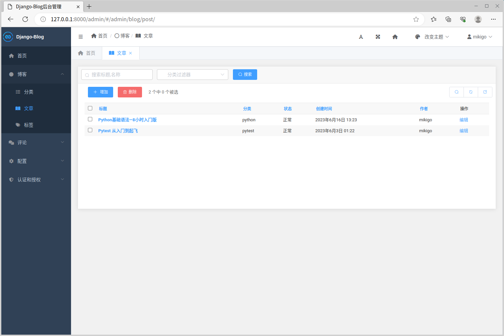
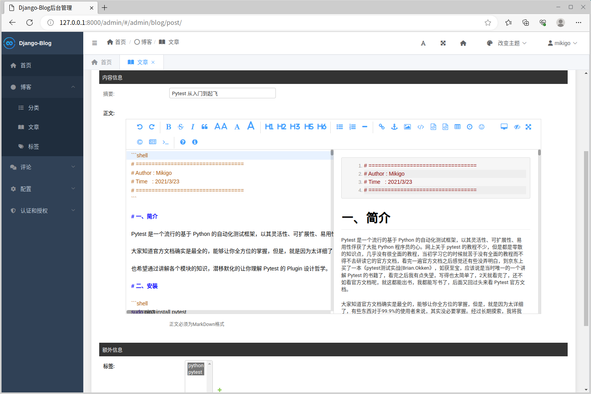

# django-blog

使用 Django 构建的博客系统；

- Django Restframework 构建 RESTful 数据接口；

- drf-yasg 构建在线接口文档；

- Django 模板引擎渲染前端；

- Bootstrap 美化前端UI；

- Django SimpleUI 强化后台管理系统；

- mistune 管理 MarkDown 内容；

- django-autocomplete-light 自动补全；

- django-ckeditor 富文本编辑器；

- pillow 处理图片；

---

**Documentation**: <a href="https://funny-dream.github.io/django-blog" target="_blank">https://funny-dream.github.io/django-blog</a>

**Source Code**: <a href="https://github.com/funny-dream/django-blog" target="_blank">https://github.com/funny-dream/django-blog</a>

---

## 部署

系统环境：deepin

安装依赖：

```shell
# 安装 pip3
sudo apt install python3-pip
# 安装 pipenv
pip3 install pipenv
# 进入工程目录
cd django-blog/
# 安装环境依赖
pipenv install
```

启动服务：

```shell
# 进入虚拟环境
pipenv shell
# 启动服务
python manage.py runserver
```

## 效果示意

首页


博客详情：


后台管理：



后台管理支持markdown编辑：



## 后记

这是一个UI上相对“简陋”的博客系统，但功能整体是可用的，奈何在下前端水平一般，所以开源出来，希望大哥们能多多指点，也欢迎大家在此基础上进行二次开发。
